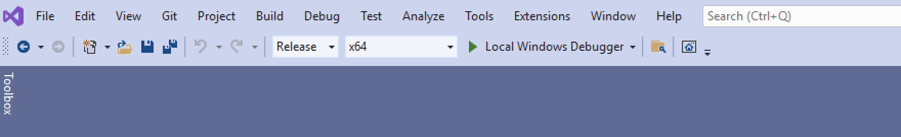

# InjectionTracer

**InjectionTracer** is a PIN tool that aims to help  the analysis of malware that uses process injection.
It allows you to:

- **Understand rapidly the injection technique used**, by looking at the Windows API involved.
- **Stop the execution** before the remote thread is executed, and put a breakpoint on the entrypoint.
- **Redirect the injection** into another process (-redirect option).
- **Automatically dump the injected code** and fix PE Image on disk (ImageBase and Section Alignment).

## Installation

To install this tool you will need to download first:
 - [Visual Studio](https://visualstudio.microsoft.com/) (also community edition is ok). Make sure to have C++ Windows development kit
 - Intel PIN > 3.19 (you can download it from [HERE](https://www.intel.com/content/www/us/en/developer/articles/tool/pin-a-binary-instrumentation-tool-downloads.html))

Then simply follow those 5 steps:

1. Extract the zip containing IntelPIN inside C:\ and rename it to "pin" so that you should have the pin executable at *C:\pin\pin.exe*
2. Move into *C:\pin\source\tools* and clone the repo.
3. Open the file *C:\pin\source\tools\InjectionTracer\InjectionTracer.sln* with Visual Studio.
4. Build the project in Release mode, both x86 and x64. 

If everything is ok, you should find **InjectionTracer.dll** inside *C:\pin\source\tools\InjectionTracer\Release* and *C:\pin\source\tools\InjectionTracer\x64\Release*

5. Double click on "addContextMenu.reg" file inside the Runner folder

Now you should find the context menu when you do a right click on an executable or a DLL.

